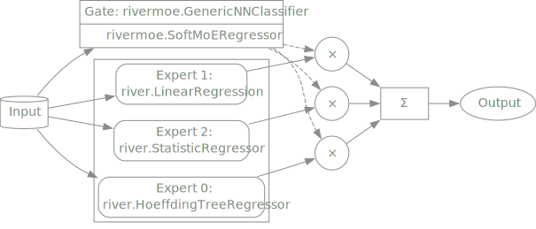

<div align="center">


<!--
[](https://github.com/bitnulleins/rivermoe/actions?query=workflow%3Abuild) [Dependencies Status](https://github.com/bitnulleins/rivermoe/pulls?utf8=%E2%9C%93&q=is%3Apr%20author%3Aapp%2Fdependabot)
-->

[](https://github.com/psf/black)
[](https://github.com/PyCQA/bandit)
[](https://github.com/bitnulleins/rivermoe/blob/master/.pre-commit-config.yaml)
[](https://github.com/bitnulleins/rivermoe/releases)
[](https://github.com/bitnulleins/rivermoe/blob/master/LICENSE)


*river*MoE is a framework that offers Mixture of Experts (MoE) for online machine learning. It combines the [river](https://github.com/online-ml/river) API and [deep-river](https://github.com/online-ml/deepriver) with the capability of designing MoE-architectures based on different machine learning or deep learning approaches.
</div>

## ⭐️ Features

MoE-Gating works like a adaptive trainable [`VotingClassifier`](https://scikit-learn.org/stable/modules/generated/sklearn.ensemble.VotingClassifier.html)!

* Works with adaptive streaming data
* Compatible with `PyTorch` modules
* Different types of MoE: Soft MoE, Top-K MoE, SAMoE¹
* Easy [API](#️-usage) for simple usage
* Modular framework for easy expansion

¹ <small>This frameworks implements the Streaming Adaptive Mixture of Experts (*SAMoE*) architecture and is part of [`riverMoE`](#-citation) publication.</small>

## ⚡️ Usage

### Example

MoE with three river experts for *TrumpApproval* dataset:

```python
>>> from rivermoe.utils.generic_nn import GenericNNClassifier
>>> from rivermoe.classification.soft_moe import SoftMoEClassifier
>>> from rivermoe.regression.soft_moe import SoftMoERegressor
>>> 
>>> # Generate neural network
>>> gate = GenericNNClassifier(
...     layer_configs=[10,],
...     activation_fn="relu",
...     loss_fn="mse",
...     output_dim=3,
...     output_activation=None,
...     optimizer_fn="sgd"
... )
>>> 
>>> # Generate MoE
>>> model = SoftMoERegressor(
...     gate = gate,
...     experts = [dummy.StatisticRegressor(stats.Mean()), tree.HoeffdingTreeRegressor(), linear_model.LinearRegression()]
... )
>>> 
>>> dataset = datasets.TrumpApproval()
>>> metric = metrics.MAE()
>>> evaluate.progressive_val_score(dataset, preprocessing.StandardScaler() | model, metric)
MAE: 0.882453
```

The same with single expert evaluation:

```python
>>> for model in [linear_model.LinearRegression(), tree.HoeffdingTreeRegressor()]:
...     model_pipeline = preprocessing.StandardScaler() | model
...     print(model.__class__.__name__)
...     print(evaluate.progressive_val_score(dataset, model_pipeline, metric))
... 
LinearRegression
MAE: 1.0985
HoeffdingTreeRegressor
MAE: 1.051035
```

Plot MoE-network:

```python
model.draw()
```



## 🚀 Installation

```bash
pip install -U rivermoe
```

or install locally with `Poetry`

1. Clone project

```bash
git clone https://github.com/bitnulleins/rivermoe.git
```

2. Run poetry

```bash
poetry add rivermoe
```

## 🔧 Technologies

- [`Poetry`](https://python-poetry.org/) as the dependencies manager. See configuration in [`pyproject.toml`](https://github.com/bitnulleins/rivermoe/blob/master/pyproject.toml) and [`setup.cfg`](https://github.com/bitnulleins/rivermoe/blob/master/setup.cfg).
- Automatic codestyle with [`black`](https://github.com/psf/black), [`isort`](https://github.com/timothycrosley/isort) and [`pyupgrade`](https://github.com/asottile/pyupgrade).
- Ready-to-use [`pre-commit`](https://pre-commit.com/) hooks with code-formatting.
- Type checks with [`mypy`](https://mypy.readthedocs.io); docstring checks with [`darglint`](https://github.com/terrencepreilly/darglint); security checks with [`safety`](https://github.com/pyupio/safety) and [`bandit`](https://github.com/PyCQA/bandit)
- Testing with [`pytest`](https://docs.pytest.org/en/latest/).

## 🛡 License

[](https://github.com/bitnulleins/rivermoe/blob/master/LICENSE)

This project is licensed under the terms of the `Apache Software License 2.0` license. See [LICENSE](https://github.com/bitnulleins/rivermoe/blob/master/LICENSE) for more details.

## 📃 Citation

> [!NOTE]
> Publication of master thesis is still in progress.

```bibtex
@misc{rivermoe,
  ...
}
```
